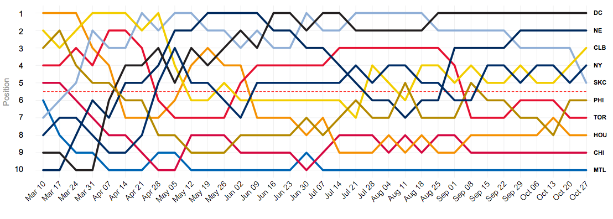

<h1 dir="RTL"> 
تمرین سری سوم: از لالیگا تا لیگ برتر
</h1>

> 
 
با استفاده از داده های لیگ دسته اول اسپانیا به سوالات زیر پاسخ دهید.
از هر دو ابزار
ggplot2
و
highcharter
برای این کار تصویرسازی استفاده نمایید.

***

۱. تعداد قهرمانی های تیم ها در تاریخ لالیگا  را استخراج کرده و نمودار ستونی آنها را رسم کنید.

***

۲. کسل کننده ترین لیگ و تیم را بیابید.
نمودار ده تیم و ده فصل کسل کننده را رسم کنید.

***

۳. در چند درصد موارد قهرمان نیم فصل در پایان فصل قهرمان شده است؟

***

۴. در بین سال های ۲۰۰۱ تا ۲۰۱۰ گربه سیاه تیم های بزرگ چه تیم هایی بوده است؟

***

۵. در تاریخ لالیگا کدام تیم رکورددار زودترین قهرمانی است؟
همچنین کدام تیم مقتدرانه ترین قهرمانی را داشته است؟

***

۶. طولانی ترین نوار پیروزی مساوی و شکست مال چه تیم هایی است؟

***

۷. زودترین سقوط مال کدام تیم بوده است؟

***

مانند شکل بالا تصویری از روند تغییر رتبه تیم ها در طول فصل ۱۹۹۸ رسم نمایید.

***

۹. جدولی مشابه بالا برای فصل ۲۰۱۲ از  کل نتایج طراحی کنید.

***

۱۰. سه آماره به همراه نمودار فردوسی پسند استخراج کنید.

