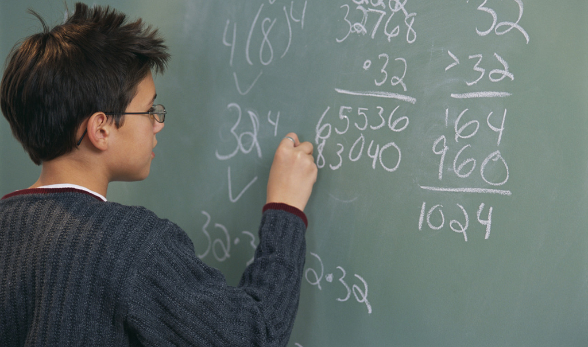

<div align="center">

</div>

<h1 dir="LTR"> 
1.
loading data:
```{r}
library(dplyr)
library(ggplot2)
bcg = readRDS("C:\\Users\\hoco\\Desktop\\data analysis\\hw_04\\DataAnalysis_data_hw4\\data\\bcg.rds")
bsa = readRDS("C:\\Users\\hoco\\Desktop\\data analysis\\hw_04\\DataAnalysis_data_hw4\\data\\bsa.rds")
bsg = readRDS("C:\\Users\\hoco\\Desktop\\data analysis\\hw_04\\DataAnalysis_data_hw4\\data\\bsg.rds")
bsr = readRDS("C:\\Users\\hoco\\Desktop\\data analysis\\hw_04\\DataAnalysis_data_hw4\\data\\bsr.rds")
bst = readRDS("C:\\Users\\hoco\\Desktop\\data analysis\\hw_04\\DataAnalysis_data_hw4\\data\\bst.rds")
btm = readRDS("C:\\Users\\hoco\\Desktop\\data analysis\\hw_04\\DataAnalysis_data_hw4\\data\\btm.rds")
bts = readRDS("C:\\Users\\hoco\\Desktop\\data analysis\\hw_04\\DataAnalysis_data_hw4\\data\\bts.rds")
tims = readRDS("C:\\Users\\hoco\\Desktop\\data analysis\\hw_04\\DataAnalysis_data_hw4\\timss_2015.rds")
View (bcg)
View (bsa)
View (bsg)
View (bsr)
View (bst)
View (btm)
View (bts)
View (tims)
```


```{r}
merge(bts, bst, by.x = c("idcntry", "idschool", "itcourse", "idteach"), by.y = c("idcntry", "idschool", "itcourse", "idteach")) %>% select(idcntry, idschool, itcourse, idteach, idstud, bsmmat01, bsmmat02, bsmmat03, bsmmat04, bsmmat05, btbg10a, btbg10b, btbg10c, btbg10d, btbg10e, btbg10f, btbg10g) %>% rowwise() %>%  mutate(goodInMath = mean(c(bsmmat01, bsmmat02, bsmmat03, bsmmat04, bsmmat05), na.rm = T)) %>% mutate(satisfaction = ifelse(btbg10b<3,1,0), na.rm = T) %>% select(goodInMath, satisfaction) -> satisfactionTeacher
hypo_tTest = t.test(goodInMath~satisfaction , data = satisfactionTeacher)
print(hypo_tTest)
#hypo_cor = cor.test(formula= ~ goodInMath + satisfaction, data = satisfactionTeacher)
#View(hypo_cor)
#satisfactionTeacher %>% ungroup() %>% group_by(satisfaction) %>% summarise(count = n()) -> tmp2
#View(tmp2)
#View(satisfactionTeacher)
#chisq.test(satisfactionTeacher) -> chisqRes
#View(chisqRes)
ggplot(satisfactionTeacher, aes(satisfaction, goodInMath, group = satisfaction, fill = satisfaction)) + geom_boxplot()
```

according to P-value, they are not independent.
</p>

> <p dir="RTL"> 
با استفاده از داده های ارزیابی تیمز ۲۰۱۵ ادعاهای زیر را مورد ارزیابی قراردهید.
برای هر سوال علاوه بر استدلال آماری که در غالب آزمون فرض تعریف می شود از تصویرسازی مناسب باهر دو ابزار
ggplot2
و
highcharter
استفاده نمایید.
به دلخواه به هفت گزاره از موارد زیر پاسخ دهید.
</p>

***

<p dir="RTL">
2.
```{r}
bsg %>% select(idcntry, idschool, idstud, bsmmat01, bsmmat02, bsmmat03, bsmmat04, bsmmat05, bsbg07a, bsbg07b) %>% group_by(idcntry, idschool, idstud) %>% filter(bsbg07a <= 7 & bsbg07b <= 7) %>%  summarise(parentsAc = mean(c(bsbg07a, bsbg07b), na.rm = T) , goodAtMath = mean(c(bsmmat01, bsmmat02 ,bsmmat03, bsmmat04, bsmmat05), na.rm = T))  -> parentsAcademic
parentsAcademic %>% mutate(newAc = ifelse(parentsAc > 4, 1, 0)) -> parentsAcademicCateg
t.test(goodAtMath~newAc, data = parentsAcademicCateg) -> parentsActTest
print(parentsActTest)
ggplot(parentsAcademicCateg, aes(newAc, goodAtMath, group = newAc, fill = newAc)) + geom_boxplot()
```
according to P-value, they are not independent.
</p>

***

<p dir="RTL">
3.
```{r}
bsg %>% select(idcntry, idschool, idstud, bsmmat01, bsmmat02, bsmmat03, bsmmat04, bsmmat05, bsbg06a, bsbg06b, bsbg06c, bsbg06d, bsbg06e, bsbg06f, bsbg06g) %>% group_by(idcntry, idschool, idstud) %>% summarise(goodAtMath = mean(c(bsmmat01, bsmmat02, bsmmat03, bsmmat04, bsmmat05), na.rm = T), refahi = mean(c(bsbg06a,bsbg06b, bsbg06c, bsbg06d, bsbg06e, bsbg06f, bsbg06g))) %>% rowwise() %>% mutate(refahi2 = ifelse(refahi < 1.5, 1, 0)) -> refahi3
aov(goodAtMath ~ refahi2, data = refahi3) -> aov3
print(summary.aov(aov3))
ggplot(refahi3, aes(refahi2, goodAtMath, group = refahi2, fill = refahi2)) + geom_boxplot()
```
according to P-value and the plot, the statement is true.
</p>

***

<p dir="RTL">
4.
```{r}

merge(bts, bst, by.x = c("idcntry", "idschool", "itcourse", "idteach"), by.y = c("idcntry", "idschool", "itcourse", "idteach")) %>% select(idcntry, idschool, itcourse, idteach, idstud, bsmmat01, bsmmat02, bsmmat03, bsmmat04, bsmmat05, btbg07b) %>% rowwise() %>%  mutate(goodAtMath = mean(c(bsmmat01, bsmmat02, bsmmat03, bsmmat04, bsmmat05), na.rm = T)) %>%  select(goodAtMath, safety = btbg07b) -> mohitAram 
#chisq.test(tmp %>% filter(goodAtMath >= 0 , safety >= 0)) %>% View()
#tmp %>% ungroup() %>% group_by(safety) %>% summarise(count = n()) -> tmp2
#chisq.test(tmp2[1:4,]) %>%  View()
aov(goodAtMath ~ safety, data = mohitAram) -> aov4
print(summary.aov(aov4))
ggplot(mohitAram, aes(safety, goodAtMath, group = safety, fill = safety)) + geom_boxplot()
```

</p>

***

<p dir="RTL">
۴. محیط آرام مدرسه نقش مهمی در پیشرفت تحصیلی دارد.
</p>

***

<p dir="RTL">
6.
```{r}
tims %>% filter(content_domain == "Geometry") %>% select(female = correct_ratio_per_question_female, male = correct_ratio_per_question_male) %>% tidyr::gather("female","male", key = "gender",value = "score") -> dscore
ggplot(dscore, aes(gender, score, group = gender, fill = gender)) + geom_boxplot()
View(dscore)
t.test(dscore[which(dscore$gender == "male"),]$score, dscore[which(dscore$gender == "female"),]$score, alternative = "t") -> tTestGeometry
print(tTestGeometry)
aov(score~gender, data = dscore) -> aov6
print(summary.aov(aov6))
```

</p>

***

<p dir="RTL"> 
7.
```{r}
bsg %>% select(bsbg12, idcntry, idschool, idstud, bsmmat01, bsmmat02, bsmmat03, bsmmat04, bsmmat05) %>% group_by(idcntry, idschool, idstud) %>% summarise(eat = mean(bsbg12) , goodAtMath = mean(c(bsmmat01, bsmmat02 ,bsmmat03, bsmmat04, bsmmat05), na.rm = T)) -> eat7
aovEat = aov(goodAtMath ~ eat, data = eat7)
print(summary.aov(aovEat))
ggplot(eat7, aes(eat, goodAtMath, fill = eat, group = eat)) + geom_boxplot()
```

</p>

***

<p dir="RTL"> 
8.
```{r}

```

</p>

***

<p dir="RTL"> 
9.
```{r}
bsg %>% select(idcntry, idschool, idstud, bsmmat01, bsmmat02, bsmmat03, bsmmat04, bsmmat05, bsbg11) %>% group_by(idcntry, idschool, idstud) %>% summarise(presence = mean(bsbg11) , goodAtMath = mean(c(bsmmat01, bsmmat02 ,bsmmat03, bsmmat04, bsmmat05), na.rm = T)) -> studentPresence
aovPresence = aov(goodAtMath ~ presence, data = studentPresence)
print(summary.aov(aovPresence))
#View(studentPresence)
#corPresence = cor.test(formula = ~goodAtMath + presence , data = studentPresence)
#View(corPresence)
ggplot(studentPresence, aes(presence, goodAtMath, fill = presence, group = presence)) + geom_boxplot()
```

</p>

***

<p dir="RTL"> 
10.
```{r}
tims %>% filter(Country == "Iran, Islamic Rep. of") %>%  filter(cognitive_domain == "Applying" | cognitive_domain == "Reasoning") -> Iran10
aov(correct_ratio_per_question~cognitive_domain, data = Iran10) -> aov10
print(summary.aov(aov10))
print(tTest10)
ggplot(Iran10, aes(cognitive_domain, correct_ratio_per_question, group = cognitive_domain, fill = cognitive_domain)) + geom_boxplot()
```

</p>

***

<p dir="RTL"> 
۱۰. دانش آموزان ایرانی در استدلال قوی تر از کاربرد هستند.
</p>

***

<p dir="RTL">
سه گزاره جالب کشف کنید و ادعای خود را ثابت نمایید.
</p>
